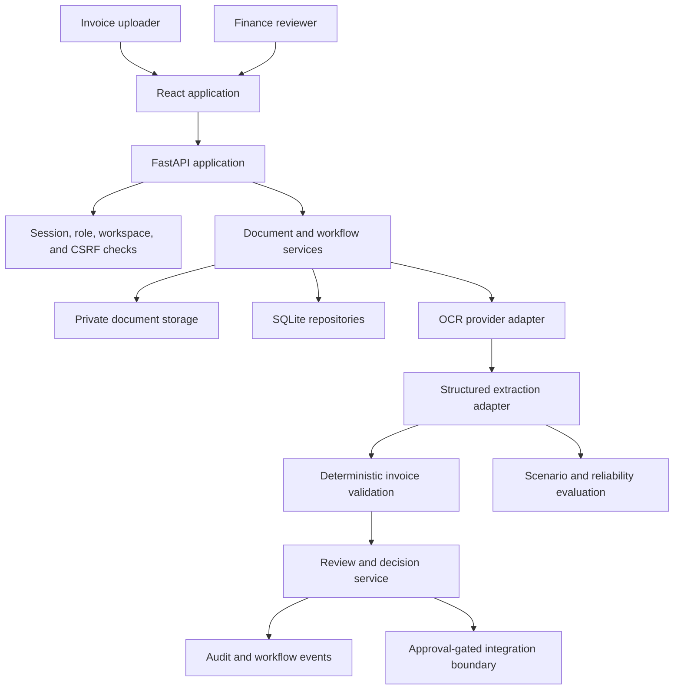

# Architecture — Invoice Review

## Design goal

Keep document extraction separate from business rules and reviewer decisions. Each step should
produce something that the next step can inspect.

## System context



## Runtime components

### Frontend

- React, TypeScript, Vite, TanStack Query, and PDF.js;
- role-focused navigation for uploaders and reviewers;
- source PDF and extracted values shown together;
- business status derived from backend workflow state;
- evaluation and operations routes kept outside the main review flow.

The frontend shows which actions are available, but it does not decide whether approval is valid.
The API enforces the same rules independently.

### API and application services

FastAPI provides:

- authentication and session APIs;
- document upload, content, processing, and retry APIs;
- invoice workflow and draft APIs;
- reviewer queue and decision APIs;
- controlled accounting export;
- operational jobs, audit export, health, readiness, and metrics;
- run and scenario-evaluation APIs.

Application services own the state transitions. API handlers translate HTTP input and output
instead of duplicating workflow rules.

Application assembly is split under `app/bootstrap/` by bounded context. The container keeps a flat
compatibility API for routers and workers, while persistence, documents, review, exports,
integrations, evaluation, operations, agent tools, and backoffice services are wired in separate
modules. Adding a service therefore changes its owning bootstrap module instead of one global
constructor.

The largest correctness paths are split by responsibility:

- backoffice planning owns plans, drafts, policy decisions, and approvals;
- backoffice execution owns reservation, heartbeat, external calls, and finalization;
- backoffice recovery owns stale and unknown-outcome reconciliation;
- export eligibility decides membership and blockers;
- export execution owns reservation, artifact generation, finalization, and retry;
- export workspace code is read-only projection and filtering;
- the export service reads `ExportableInvoice` projections through an export-facing contract rather
  than assembling rows from the document aggregate itself.

The original service classes remain as compatibility facades, so API and workflow contracts do not
depend on the internal split.

Document processing follows the same pattern. `DocumentProcessingService` owns authorization,
workspace checks, lease coordination, and provider orchestration. `ProcessingRetryPolicy` owns
failure classification and backoff, while `ProcessingResultRecorder` owns atomic result, audit,
job, and workflow writes. The public processing methods and mutable provider hooks remain unchanged
for worker and test compatibility.

`DocumentStateWriter` is the single application operation for status changes. It validates the
transition, records the audit event, and saves the document inside one transaction. Review, retry,
processing, integration, and export services do not persist those pieces independently.

### Provider adapters

The OCR and extraction interfaces support deterministic mocks and real HTTP providers.

```text
PDF bytes -> OCR text and pages -> invoice proposal -> grounding guard -> validation
```

The extraction prompt tells the model not to fill unsupported values. A seller-context guard rejects
an ambiguous vendor proposal before validation. Timeouts, retryable errors, and terminal provider
errors are represented separately.

### Validation

Validation runs after extraction and after a reviewer changes a value. It currently checks:

- required invoice fields;
- date and numeric normalization;
- subtotal, tax, total, and line-item consistency;
- supported values such as currency;
- duplicate vendor and invoice-number pairs within a workspace.

Validation errors send the invoice to correction and block approval.

### Persistence and storage

The local profile stores application state in SQLite and invoice files in private local storage.
Persisted records include documents, extracted fields, source information, jobs, retries, workflow
state, decisions, audit events, and evaluation runs. In-memory metadata storage is limited to
disposable local tests; hosted modes refuse to start with it.

SQLite connection and transaction ownership live in `sqlite_store.py`; schema creation, migrations,
indexes, and backfills live in `sqlite_schema.py`; aggregate repositories remain in
`sqlite_repositories.py`. Metrics, provider health, and processing-job monitoring use
workspace-scoped SQL read models with a fixed query count instead of loading every record into the
application process.

Memory repositories follow the same explicit-save semantics as SQLite. They store and return
snapshots, so mutating an object returned by `get()` or `list_*()` cannot change repository state
until `save()` is called. Shared repository contract tests protect this parity.

The storage interface can target an S3-compatible service, but the default demo stays
self-contained.

Workers claim one queued job atomically and receive a unique lease token. Heartbeats and terminal
writes must present that token. A running job can be reclaimed with a new token only after its lease
expires, and the former holder can no longer renew or finalize it. Provider work stays outside the
database transaction; the token fences the transaction that stores the result.

## State and decision model

The main invoice lifecycle is:

```text
uploaded -> queued -> processing -> extracted -> needs_review -> approved -> exported
                                                |
                                                -> rejected
```

Processing failures and exhausted retries are tracked separately. Approved, rejected, and exported
records cannot be changed through the intake draft API.

`needs_correction` is a business/UI projection, not a separate `DocumentStatus`. It describes a
document that remains in `needs_review` while validation errors or a correction request still need
attention. This keeps the persisted lifecycle small without hiding the review outcome from users.

The following rules are enforced:

1. Extraction confidence cannot approve an invoice.
2. Approval requires a reviewer and a reviewable invoice state.
3. Validation errors block approval.
4. Export requires approval.
5. A failed delivery keeps the approval and does not mark the export as complete.
6. Workspace checks apply to reads and writes.

There are two export boundaries. The controlled batch path stores a durable run and generated
artifact before finalizing the batch; an accounting integration records `exported` only after a
confirmed delivery receipt. The older direct CSV endpoint is a local compatibility/download path:
it treats successful in-process rendering as the export event. It is not evidence that a browser
received the response or that an external accounting system accepted the file, so it is not the
recommended production delivery path.

Local backoffice commands commit their related records in one transaction. Controlled external
execution uses two transactions: the first reserves the action as `executing`, the tool call runs
without holding the database lock, and the second stores the outcome. A durable heartbeat
distinguishes an active call from a process that stopped. If the external outcome cannot be
confirmed, the second transaction fails, or the heartbeat remains stale for five minutes, replay
does not call the tool again. An administrator must reconcile that reserved action through the
dedicated endpoint. Each reservation remains bound to its original plan and step, and the service
rejects replanning until the active execution has been finalized or reconciled.

## Security model

The local application includes:

- session cookies backed by server-owned role and workspace data;
- CSRF origin checks for cookie-authenticated changes;
- request rate limiting;
- content-security, frame, MIME, referrer, and permissions headers;
- upload type and size restrictions;
- private PDF content routes;
- request and trace identifiers;
- audit events for approval, rejection, correction, and export.

These controls are sufficient for the local demo. A production deployment would still need managed
identity, secrets, network controls, monitoring, and tenant lifecycle management.

## Deployment boundary

The implemented runtime is a single-node modular monolith. SQLite is the only persistent metadata
adapter, and browser sessions and request rate limits are process-local. Multiple worker processes
sharing the same database are protected by lease fencing, but SQLite remains a single-writer
bottleneck. The export workspace projection still filters and enriches records in the application
process, so it is not presented as a high-volume read model.

The Compose PostgreSQL profile is a target dependency for future work, not an implemented
repository adapter. Horizontal deployment requires PostgreSQL repositories, shared session and
rate-limit state, durable delivery coordination, and multi-process failure tests.

## Reliability and evaluation

The project tracks two different types of results:

- invoice evaluation compares expected fields and validation outcomes with versioned synthetic PDFs;
- workflow records show tool calls, blocked actions, escalation, and state transitions.

Extraction accuracy and workflow safety are reported separately because they can fail for different
reasons.

## Existing internal names

Three historical backend namespaces are still active:

| Namespace    | Current responsibility                                                                 | Product exposure                                                                           |
| ------------ | -------------------------------------------------------------------------------------- | ------------------------------------------------------------------------------------------ |
| `backoffice` | Workflow state, policy, approvals, audit projection, and the shell workspace contract. | `/backoffice/workspace` supports the signed-in shell. The name is not shown in navigation. |
| `agent`      | Bounded tool contracts and stored run records used by workflow services.               | No primary product page.                                                                   |
| `agentops`   | Scenario and run records used for technical evaluation.                                | No primary product page.                                                                   |

These folders are not dead code. Renaming them during the UI refactor would have added migration
risk without changing the product. A future rename should begin with API aliases and repository
contracts, then remove the old names after callers and migration tests have moved.

## Extension point

Invoice is the only complete schema. The shared document, workflow, audit, storage, and provider
interfaces can support another document type later. A second workflow should not be added until its
extraction, validation, review, execution, and evaluation paths are complete.
