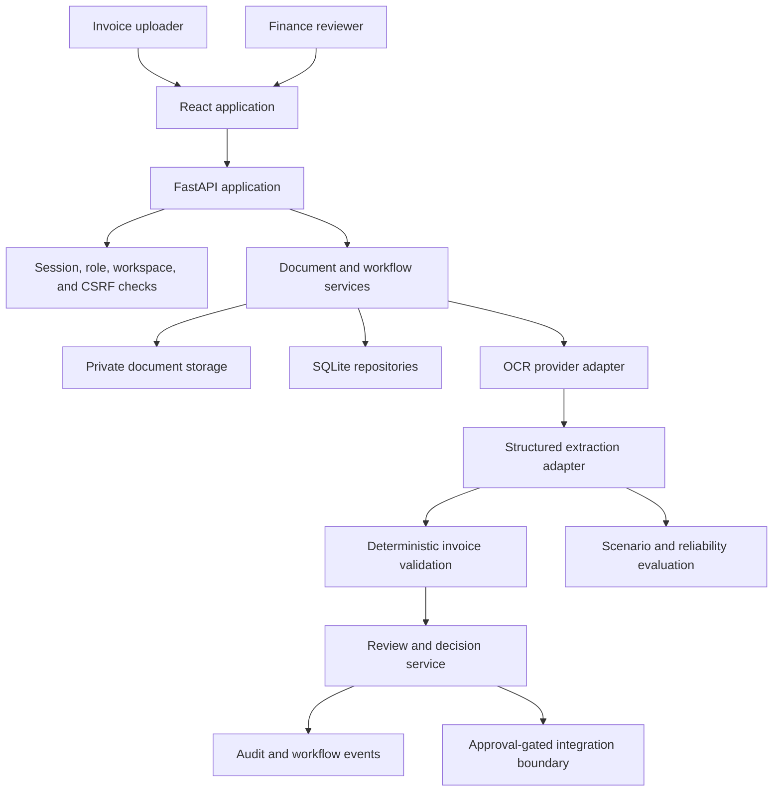

# Architecture - Invoice Review

## Design Goal

Keep probabilistic document reading separate from deterministic business safeguards and human
authority. Each layer produces evidence that the next layer can inspect.

## System Context



## Runtime Components

### Frontend

- React, TypeScript, Vite, TanStack Query, and PDF.js
- role-focused navigation for uploader and reviewer
- source PDF and extracted values presented together
- business status derived from backend workflow state
- technical evidence routes separated from the primary review flow

The frontend does not decide whether approval is valid. It reflects backend capabilities and
disables impossible actions for clarity; the API enforces the same rules independently.

### API and application services

FastAPI composes:

- authentication and session APIs
- document upload, content, processing, and retry APIs
- invoice workflow and draft APIs
- reviewer queue and decision APIs
- controlled accounting export
- operational jobs, audit export, health, readiness, and metrics
- technical run and scenario-evaluation APIs

Application services own state transitions. API handlers translate HTTP input and output rather
than duplicating policy logic.

### Provider boundary

The parsing and extraction interfaces support deterministic mocks and real HTTP adapters.

```text
PDF bytes -> OCR text/pages -> structured invoice candidate -> grounding guard -> validation
```

The extractor is instructed not to infer missing values. A conservative seller-context guard
rejects an ambiguous vendor candidate before validation. Provider timeouts and transient versus
non-retryable failures are explicit.

### Validation boundary

Validation is deterministic and runs after extraction or a reviewer correction. Current checks
cover:

- required invoice fields
- date and value normalization
- subtotal, tax, total, and line-item consistency
- supported values such as currency
- duplicate vendor and invoice-number pairs within a workspace

Error-level findings route the invoice to correction and block approval.

### Persistence and storage

The local profile uses repository-backed SQLite state and private local document storage. Stored
state includes documents, extraction evidence, jobs, retries, workflow records, decisions, audit
events, and evaluation runs. The document object-storage boundary can target an S3-compatible
service, but the default demo is self-contained.

## State and Decision Model

The business journey is projected from durable backend state:

```text
uploaded -> processing -> needs_review -> approved -> exported
                         |              |
                         |              -> rejected
                         -> needs_correction
```

Processing failures and retry exhaustion are represented separately. Approved, rejected, and
exported evidence is immutable through the intake draft API.

Decision invariants:

1. Extraction confidence does not approve an invoice.
2. Approval requires reviewer capability and a reviewable document state.
3. Error-level validation findings block approval.
4. Export requires an approved state.
5. Failed external delivery does not erase approval or falsely mark export complete.
6. Workspace boundaries apply to reads and writes.

## Security Model

The local application includes:

- token-backed session cookies with role and workspace context
- CSRF origin checks for cookie-authenticated mutations
- request rate limiting
- content security, frame, MIME, referrer, and permissions headers
- upload type and size policies
- private PDF content endpoints
- request and trace identifiers
- audit events for consequential operations

These controls make the local demo defensible, but they are not a substitute for production
identity, managed secrets, network controls, monitoring, and tenancy lifecycle.

## Reliability and Evaluation

Two evidence layers are deliberately separate:

- invoice scenario evaluation compares expected fields and validation behavior against versioned
  synthetic PDFs
- run evidence records tool choice, blocked actions, escalation, and workflow traces

This separation prevents extraction quality from being confused with workflow safety.

## Internal Contract Inventory

The active application still depends on three historical backend namespaces:

| Namespace | Current responsibility | Product exposure |
| --- | --- | --- |
| `backoffice` | Workflow state, policy, approvals, audit projection, and the shell workspace contract. | `/backoffice/workspace` supports the signed-in shell; the name is not shown in navigation. |
| `agent` | Bounded tool contracts and stored run evidence used by workflow services. | No primary product page. |
| `agentops` | Scenario and run-evidence records retained for technical evaluation. | No primary product page. |

They are active internal contracts, not unused folders. Deleting or broadly renaming them during a
UI refactor would risk approval, audit, and workspace behavior. A future behavior-preserving rename
should begin with API aliases and repository contracts, then remove the historical names only after
all callers and migration tests have moved.

## Extension Boundary

Invoice is the only complete schema. Shared document, policy, workflow, audit, storage, and
provider interfaces can support another document type later, but no second workflow is claimed
until its extraction, validation, review, execution, and evaluation contracts are implemented.
