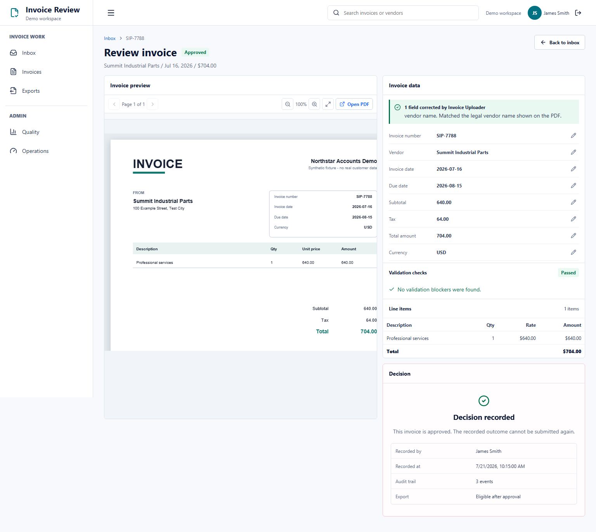
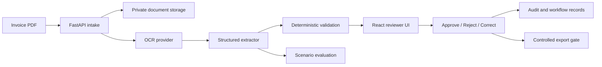

# AI Document Operations System

An invoice-review application that combines OCR and structured extraction with deterministic
validation, explicit reviewer decisions, and an auditable workflow.

The system is designed for a finance operations reviewer who needs to answer three questions:

1. What did the system read from the invoice?
2. Is there a reason this invoice should not be approved?
3. What decision was made, by whom, and on what evidence?

[](docs/assets/demo/ai-document-ops-demo.mp4)

**[Watch the 3:37 captioned recruiter demo](docs/assets/demo/ai-document-ops-demo.mp4).** It shows
a clean approval path followed by a duplicate invoice whose approval is blocked. The recording uses
the committed synthetic PDFs and a deterministic UI contract harness; provider-backed extraction
evidence is reported separately below.

## Product Flow

```text
Upload PDF -> OCR and extract fields -> Validate business rules
           -> Reviewer checks PDF and data -> Approve, reject, or request correction
           -> Record the decision and control any export
```

The primary UI stays focused on upload and review. Provider diagnostics, run traces, and
scenario evaluation remain available as technical evidence without entering the daily user
flow.

## Responsibility Boundaries

| Layer | Responsibility |
| --- | --- |
| AI providers | Read the PDF and return structured invoice fields with source evidence. |
| Deterministic code | Check required fields, arithmetic, duplicates, state transitions, roles, and export gates. |
| Human reviewer | Compare the PDF with extracted data and make the consequential decision. |

A high-confidence extraction never approves an invoice. Error-level validation issues disable
approval in the UI and are rejected independently by the backend.

## Architecture



The local profile uses React, TypeScript, FastAPI, SQLite, and private local file storage. Real
provider verification uses Mistral OCR and a Groq-hosted structured extraction model. Provider
adapters are configured through environment variables and can be replaced by deterministic
mocks for offline development.

## Observed Evidence

| Evidence | Current result |
| --- | --- |
| Provider-backed workflow | Upload, OCR, extraction, review queue, explicit approval, and six audit events observed locally. |
| Synthetic invoice set | 20 deterministic PDFs covering normal, missing-field, mismatch, duplicate, low-contrast, rotated, and multi-page cases. |
| Final controlled regression | 160 / 160 evaluated fields and 20 / 20 expected validation outcomes on that synthetic set. |
| External licensed holdout | First sealed 10-document FATURA holdout exposed provider availability failure: 1 / 10 documents succeeded, so external robustness is not claimed. |
| Reviewer correction loop | Correction requests route back to the uploader, preserve original AI output, store before/after diffs, and return the invoice to review. |
| Approval boundary | Duplicate and other error-level cases are blocked in both UI and API tests. |
| Automated verification | 393 backend tests passed with 2 skipped; 13 frontend tests passed; lint and production build passed. |

The controlled regression is a small synthetic golden set, not a production accuracy claim.
See [scenario evidence](docs/invoice-scenarios-v1-evidence.md) for the initial failures, fixes,
latency observation, and claim boundaries.
See [external evaluation](docs/external-invoice-evaluation-v1.md) for the failed sealed holdout and
provider-availability boundary.

## Quick Start

Prerequisites: Python 3.11+, Node.js, and npm.

```powershell
.\scripts\setup_local_venv.ps1

Push-Location frontend
npm ci
npm run build
Pop-Location

.\scripts\start_dev.ps1
```

Open `http://127.0.0.1:8000`. The local credentials in `.env.example` are `uploader-123` for
invoice intake, `reviewer-123` for review, and `123` for local administration. Each credential is
exchanged for a server-owned role session. The default profile uses deterministic mock providers
and requires no AI-provider credential.

For real providers, copy `.env.example` to the ignored `.env`, set
`PARSER_PROVIDER=mistral`, `EXTRACTOR_PROVIDER=openai_compatible`, and provide the documented
provider variables. Never commit `.env` or real invoices. Full instructions are in
[RUNBOOK.md](RUNBOOK.md).

## Quality Gates

```powershell
$env:ENV_FILE = ".env.example"
$env:PYTHONPATH = "backend"
.\.venv\Scripts\python.exe -m unittest discover -s backend/app/tests -t backend
.\.venv\Scripts\python.exe -m ruff check backend scripts

Push-Location frontend
npm test
npm run lint
npm run build
Pop-Location
```

## Honest Limitations

- Invoice is the only complete document workflow.
- Evaluation uses synthetic fixtures and one external licensed synthetic holdout; no customer
  dataset, production accuracy, or real-world robustness is claimed.
- Time savings, cost reduction, and production accuracy have not been measured.
- The default authentication and persistence profile is intended for a local portfolio demo.
- Hosted tenancy, production monitoring, backups, secret management, and live ERP delivery are
  not implemented.
- Human approval remains mandatory for consequential actions.

## Read Next

- [Portfolio case study](PORTFOLIO_CASE_STUDY.md)
- [Recruiter evidence pack](RECRUITER_EVIDENCE_PACK.md)
- [Scenario coverage matrix](SCENARIO_COVERAGE_MATRIX.md)
- [External invoice evaluation](docs/external-invoice-evaluation-v1.md)
- [Reviewer correction feedback](docs/reviewer-correction-feedback.md)
- [Product requirements](PRD.md)
- [Architecture](ARCHITECTURE.md)
- [Runbook](RUNBOOK.md)
- [Roadmap](ROADMAP.md)
- [Demo video notes and reproduction](docs/demo-video.md)
- [Demo script](docs/demo-script.md)
- [Reliability report](docs/reliability-report.md)
