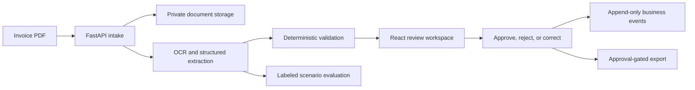

# Invoice Review

An accounts-payable workflow for uploading invoices, checking extracted data against the source
PDF, resolving blockers, recording reviewer decisions, and exporting approved records.

[](docs/assets/demo/invoice-review-demo.mp4)

## Workflow

```text
Upload PDF -> Read and extract -> Validate -> Review or correct
           -> Record decision -> Export approved invoice
```

The product UI is organized around three daily tasks:

- **Inbox**: invoices that need a decision or have a blocking issue.
- **Invoices**: the complete invoice lifecycle and upload entry point.
- **Exports**: approved invoices that are eligible for controlled delivery.

Administrators also have **Quality** for labeled-test results and **Operations** for service failures,
job retries, integrations, and audit events.

## Control Boundaries

| Layer                          | Responsibility                                                                                     |
| ------------------------------ | -------------------------------------------------------------------------------------------------- |
| Document providers             | Read the PDF and propose structured invoice fields with source evidence.                           |
| Deterministic application code | Enforce required fields, arithmetic, duplicate checks, state transitions, roles, and export gates. |
| Human reviewer                 | Compare the PDF with the proposed data and make the consequential decision.                        |

Extraction confidence never approves an invoice. Error-level validation findings block approval in
both the interface and API. Correction requests preserve the original proposal and append a
before/after record. Exports require approval and use idempotency controls.

## Architecture



The local stack is React, TypeScript, FastAPI, SQLite, and private local file storage. Mock providers
support credential-free development. The verified provider configuration uses Mistral OCR and an
OpenAI structured extraction model.

## Results And Limits

| Observed result                                                                                                                  | Boundary                                                                                                  |
| -------------------------------------------------------------------------------------------------------------------------------- | --------------------------------------------------------------------------------------------------------- |
| 20 deterministic invoice scenarios cover clean, missing-field, mismatch, duplicate, low-contrast, rotated, and multi-page cases. | A small synthetic golden set, not production accuracy.                                                    |
| The controlled synthetic regression reached 160/160 evaluated fields and 20/20 expected validation outcomes.                     | Results apply only to the committed scenario version and configuration.                                   |
| A sealed 10-document external synthetic holdout reached 98.75% field match and 100% validation match.                            | One due-date hallucination was documented; the pack is not customer data or statistically representative. |
| Review corrections retain the original extraction, actor, reason, timestamp, and field diff.                                     | No learning or automatic model update is claimed.                                                         |
| 453 backend tests passed with 2 skipped; 13 frontend tests, lint, and production build passed at the last full baseline.         | Hosted infrastructure, live scanner, and independent security testing remain external gates.              |

No time saving, cost reduction, customer outcome, or production robustness claim is made. Invoice is
the only complete document workflow, and human approval remains mandatory for consequential actions.

## Quick Start

Prerequisites: Python 3.11+, Node.js 22, and npm 10 or 11.

```powershell
.\scripts\setup_local_venv.ps1

Push-Location frontend
npm ci
npm run build
Pop-Location

.\scripts\start_dev.ps1
```

Open `http://127.0.0.1:8000`.

Local demo credentials from `.env.example`:

| Role          | Token          |
| ------------- | -------------- |
| Uploader      | `uploader-123` |
| Reviewer      | `reviewer-123` |
| Administrator | `123`          |

Each token is exchanged for a server-owned role session. The default mock-provider profile requires
no external credential.

For provider-backed runs, copy `.env.example` to the ignored `.env`, configure
`PARSER_PROVIDER=mistral_ocr` and `EXTRACTOR_PROVIDER=llm_json`, then add the documented provider
credentials. Never commit `.env` or real invoices. See [RUNBOOK.md](RUNBOOK.md).

## Quality Gates

```powershell
$env:ENV_FILE = ".env.example"
$env:PYTHONPATH = "backend"
.\.venv\Scripts\python.exe -m unittest discover -s backend/app/tests -t backend
.\.venv\Scripts\python.exe -m ruff format --check backend scripts run_tests.py
.\.venv\Scripts\python.exe -m ruff check backend scripts run_tests.py

Push-Location frontend
npm test
npm run lint
npm run build
npm run test:e2e
Pop-Location
```

## Documentation

- [Portfolio case study](PORTFOLIO_CASE_STUDY.md)
- [Product requirements](PRD.md)
- [Architecture](ARCHITECTURE.md)
- [Runbook](RUNBOOK.md)
- [Roadmap](ROADMAP.md)
- [Scenario coverage matrix](SCENARIO_COVERAGE_MATRIX.md)
- [Evidence index](docs/INDEX.md)
- [Security posture](docs/security/SECURITY_POSTURE.md)
