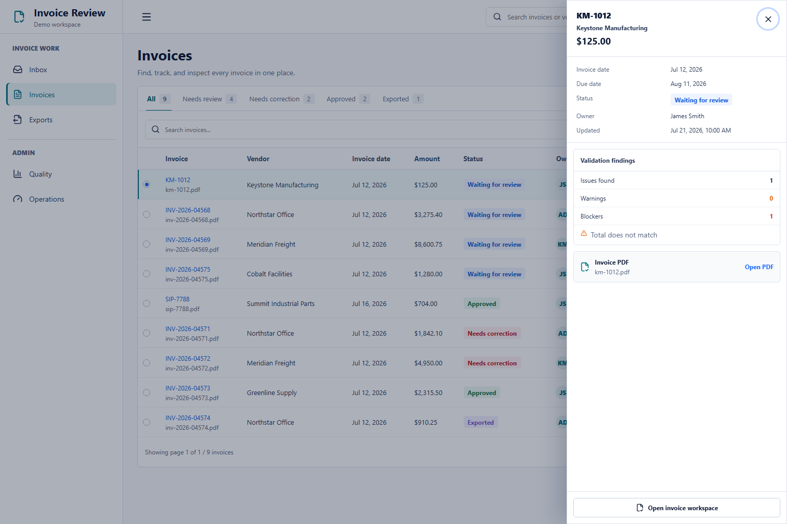
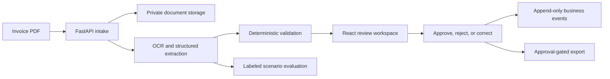

# Invoice Review

I built Invoice Review for a common accounts-payable task: compare an invoice PDF with extracted
data, fix or reject incorrect values, record the review decision, and export only approved records.

[](docs/assets/demo/invoice-review-demo.mp4)

## How it works

```text
Upload PDF -> Read and extract -> Validate -> Review or correct
           -> Record decision -> Export approved invoice
```

The main product is organized around three daily tasks:

- **Inbox** shows invoices that need a decision or have a blocking issue.
- **Invoices** shows the full invoice lifecycle and provides the upload entry point.
- **Exports** contains approved invoices that can be prepared for delivery.

Administrators also have **Quality** for labeled evaluation results and **Operations** for failed
jobs, retries, integrations, and audit events.

## Who decides what

| Layer              | Responsibility                                                                               |
| ------------------ | -------------------------------------------------------------------------------------------- |
| Document providers | Read the PDF and propose invoice fields with source information.                             |
| Application rules  | Check required fields, totals, duplicates, state transitions, roles, and export eligibility. |
| Human reviewer     | Compare the PDF with the proposed data and approve, reject, or request a correction.         |

Confidence alone cannot approve an invoice. Validation errors block approval in both the UI and the
API. A correction keeps the original proposal and records the before/after values. Export is
available only after approval and uses idempotency controls to prevent duplicate execution.

## Architecture



The local stack uses React, TypeScript, FastAPI, SQLite, and private local file storage. Mock
providers make the full workflow available without paid credentials. The tested real-provider
configuration uses Mistral OCR and an OpenAI structured extraction model.

## Results

- The committed evaluation set contains 20 synthetic invoices covering clean cases, missing fields,
  mismatches, duplicates, low-contrast scans, rotation, and multiple pages.
- A clean-commit provider diagnostic matched 160 of 160 fields and all 20 expected validation
  outcomes.
- A separate sealed holdout of 10 licensed synthetic invoices reached 98.75% field match and 100%
  validation match. One unsupported due date was still generated and remains documented.
- Reviewer corrections retain the original extraction, actor, reason, timestamp, and field-level
  diff.
- The release command checks the backend, frontend, dependencies, production build, fixture-based
  browser tests, and one browser test against the local full stack.

Exact release counts and environment details are stored in
[release verification](docs/evidence/release-verification.json). Provider results, including failed
runs, are recorded in the [evaluation log](docs/evaluation-experiment-log.md).

## Current limitations

The evaluation uses a small synthetic dataset. I have not measured production accuracy, reviewer
time savings, cost savings, or customer impact. Invoice is the only complete document workflow.
SQLite, local storage, and seeded roles are used for local evaluation; they are not a production
tenancy setup. Every approval still requires a reviewer.

## Quick start

For the fastest setup, use Docker Desktop. This starts both the API and background worker:

```powershell
.\scripts\start_docker.ps1
```

Open `http://127.0.0.1:8000` after the API reports ready.

For local source development, install Python 3.11+ and Node.js 22.22+ with npm 10 or 11:

```powershell
.\scripts\setup_local_venv.ps1

Push-Location frontend
npm ci
npm run build
Pop-Location

.\scripts\start_dev.ps1
```

The launcher supervises both the API and worker. Press Ctrl+C in its terminal to stop both.

Local demo credentials from `.env.example`:

| Role          | Token          |
| ------------- | -------------- |
| Uploader      | `uploader-123` |
| Reviewer      | `reviewer-123` |
| Administrator | `123`          |

Each token is exchanged for a server-owned role session. The default mock-provider profile requires
no external credentials.

For a provider-backed run, copy `.env.example` to the ignored `.env`, set
`PARSER_PROVIDER=mistral_ocr` and `EXTRACTOR_PROVIDER=llm_json`, and add the documented provider
credentials. Never commit `.env` or real invoice files. See [RUNBOOK.md](RUNBOOK.md) for the full
setup.

## Tests and release checks

Run the complete local release check from a clean worktree:

```powershell
.\.venv\Scripts\python.exe scripts\verify_release.py --write-evidence
```

The command records the tested commit, environment, checks, test counts, and reviewed dependency
exceptions in [release verification](docs/evidence/release-verification.json). Real-provider
evaluation is separate because it requires credentials and paid API calls.

## Documentation

- [Portfolio case study](PORTFOLIO_CASE_STUDY.md)
- [Recruiter project tour](docs/recruiter-evidence-pack.md)
- [Usability study protocol](docs/usability-study-protocol.md)
- [Product requirements](PRD.md)
- [Architecture](ARCHITECTURE.md)
- [Runbook](RUNBOOK.md)
- [Roadmap](ROADMAP.md)
- [Scenario coverage matrix](SCENARIO_COVERAGE_MATRIX.md)
- [Technical evidence index](docs/INDEX.md)
- [Security posture](docs/security/SECURITY_POSTURE.md)
