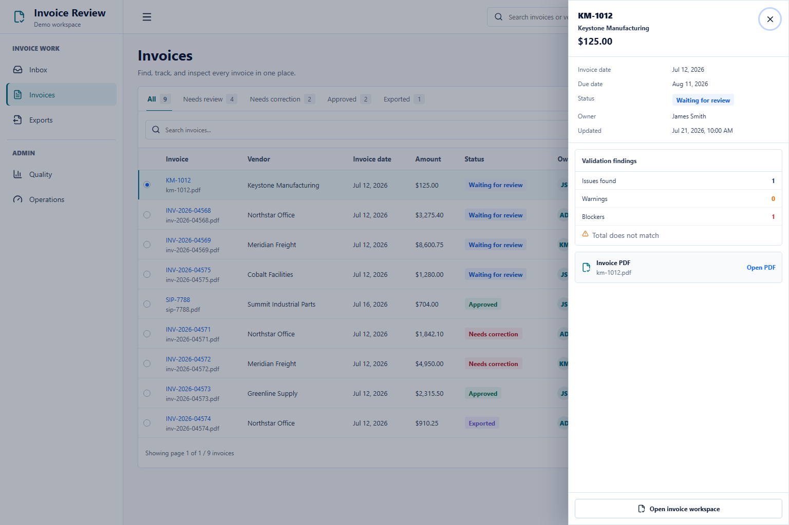
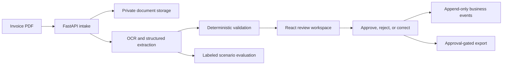

# AI-Powered Invoice Review & Approval System

A human-controlled accounts-payable workflow for comparing invoice PDFs with AI-extracted data,
correcting errors, recording reviewer decisions, and exporting only approved records. The concise
in-product name is **Invoice Review**.

[](docs/assets/demo/invoice-review-demo.mp4)

## How it works

```text
Upload PDF -> Read and extract -> Validate -> Review or correct
           -> Record decision -> Export approved invoice
```

The main product is organized around three daily tasks:

- **Inbox** shows invoices that need a decision or have a blocking issue.
- **Invoices** shows the full invoice lifecycle and provides the upload entry point.
- **Exports** contains approved invoices that can be prepared for delivery.

Administrators also have **Quality** for labeled evaluation results and **Operations** for failed
jobs, retries, integrations, and audit events.

## Who decides what

| Layer              | Responsibility                                                                               |
| ------------------ | -------------------------------------------------------------------------------------------- |
| Document providers | Read the PDF and propose invoice fields with source information.                             |
| Application rules  | Check required fields, totals, duplicates, state transitions, roles, and export eligibility. |
| Human reviewer     | Compare the PDF with the proposed data and approve, reject, or request a correction.         |

Confidence alone cannot approve an invoice. Validation errors block approval in both the UI and the
API. A correction keeps the original proposal and records the before/after values. Export is
available only after approval and uses idempotency controls to prevent duplicate execution.

## Architecture


```mermaid
flowchart LR
    PDF["Invoice PDF"] --> API["FastAPI intake"]
    API --> STORE["Private document storage"]
    API --> READ["OCR and structured extraction"]
    READ --> RULES["Deterministic validation"]
    RULES --> UI["React review workspace"]
    UI --> DECISION["Approve, reject, or correct"]
    DECISION --> AUDIT["Append-only business events"]
    DECISION --> EXPORT["Approval-gated export"]
    READ --> QUALITY["Labeled scenario evaluation"]
```

The default local stack uses React, TypeScript, FastAPI, SQLite, and private local file storage. Mock
providers make the full workflow available without paid credentials. A temporary production-shaped
Azure profile has also been validated with Container Apps, PostgreSQL, private Blob Storage, Service
Bus, Functions/Event Grid, Key Vault, and Managed Identity, then fully torn down. See the
[controlled Azure live validation](docs/azure-live-validation.md). The tested real-provider
configuration uses Mistral OCR and an OpenAI structured extraction model.

## Results

- The sealed holdout of 10 licensed synthetic invoices reached **98.75% exact field match
  (79/80)**.
- The same holdout reached **100% validation-code match** and **100% approval-blocker match**.
- Across six paired draft-eligible synthetic invoices, median elapsed time from opening the source
  to a verified ERPNext draft was **153 seconds for direct entry** and **49 seconds through the
  application**, a **68.0% reduction** for this single-operator local run.
- In the combined 10-case outcome record, the application produced the expected draft or blocker
  outcome in **10/10 cases**, compared with **9/10** for direct manual entry. The four blocker
  observations were retained from the earlier run and excluded from the draft-time median.
- ERPNext draft delivery is also covered by approval, mapping, idempotency, permission,
  reconciliation, and retry checks.
- The recorded clean release passed its backend coverage gate with at least **91.21% line
  coverage**.
- A separate clean provider diagnostic matched 160 of 160 fields and all 20 expected validation
  outcomes. This was a diagnostic on a previously used deterministic synthetic set, not the primary
  holdout result.
- Reviewer corrections retain the original extraction, actor, reason, timestamp, and field-level
  diff.
- Supporting release evidence records 521 backend tests, 23 frontend tests, 29 fixture-browser
  tests, and one browser journey against the local full stack.
- A controlled Azure run successfully migrated PostgreSQL, reached a healthy API revision, and
  processed a synthetic PDF through Blob Storage and Service Bus to `needs_review` before verified
  zero-resource teardown.

One unsupported due date remained in the sealed holdout and is documented in the evaluation
record. These results describe fixed synthetic datasets and local verification, not production
accuracy or customer outcomes.

## Evidence at a glance

| Evidence                                | Direct record                                                                                    |
| --------------------------------------- | ------------------------------------------------------------------------------------------------ |
| External evaluation summary             | [External Invoice Evaluation V2](docs/external-invoice-evaluation-v2.md)                         |
| Sealed holdout result                   | [Holdout JSON](docs/evidence/external-invoice-v2-holdout-final.json)                             |
| Clean release checks and counts         | [Release verification JSON](docs/evidence/release-verification.json)                             |
| ERPNext integration verification        | [Phase 7 verification](docs/erpnext-phase7-verification.md)                                      |
| ERPNext paired draft timing             | [Timing results](docs/erpnext-paired-draft-timing-results.md)                                    |
| ERPNext benchmark method                | [Controlled benchmark protocol](docs/erpnext-benchmark-protocol.md)                              |
| Experiment history and failure analysis | [Evaluation experiment log](docs/evaluation-experiment-log.md)                                   |
| Retained localized-number failure       | [Failed diagnostic JSON](docs/evidence/current-provider-diagnostic.failed-20260728T080824Z.json) |
| One-minute evidence path                | [Recruiter evidence pack](docs/recruiter-evidence-pack.md)                                       |
| Product walkthrough                     | [Captioned demo video](docs/assets/demo/invoice-review-demo.mp4)                                 |
| Controlled Azure deployment             | [Azure live validation](docs/azure-live-validation.md)                                           |

## Current limitations

The evaluation uses small synthetic datasets. The workflow-time comparison covers one operator and
six known synthetic draft cases. The 10-case outcome record combines those reruns with four
retained blocker observations; it is not one same-session 20-trial run and does not measure
production accuracy, multi-user time savings, cost savings, or customer impact. Invoice is the only
complete document workflow. SQLite, local storage, and seeded roles remain the default local
evaluation profile. The Azure result is a temporary mock-provider integration validation, not a
production tenancy, sustained hosting, or customer deployment. Every approval still requires a
reviewer.

## Quick start

For the fastest setup, use Docker Desktop. This starts both the API and background worker:

```powershell
.\scripts\start_docker.ps1
```

Open `http://127.0.0.1:8000` after the API reports ready.

For local source development, install Python 3.11+ and Node.js 22.22+ with npm 10 or 11:

```powershell
.\scripts\setup_local_venv.ps1

Push-Location frontend
npm ci
npm run build
Pop-Location

.\scripts\start_dev.ps1
```

The launcher supervises both the API and worker. Press Ctrl+C in its terminal to stop both.

Local demo credentials from `.env.example`:

| Role          | Token          |
| ------------- | -------------- |
| Uploader      | `uploader-123` |
| Reviewer      | `reviewer-123` |
| Administrator | `123`          |

Each token is exchanged for a server-owned role session. The default mock-provider profile requires
no external credentials.

For a provider-backed run, copy `.env.example` to the ignored `.env`, set
`PARSER_PROVIDER=mistral_ocr` and `EXTRACTOR_PROVIDER=llm_json`, and add the documented provider
credentials. Never commit `.env` or real invoice files. See [RUNBOOK.md](RUNBOOK.md) for the full
setup.

## Tests and release checks

Run the complete local release check from a clean worktree:

```powershell
.\.venv\Scripts\python.exe scripts\verify_release.py --write-evidence
```

The command records the tested commit, environment, checks, test counts, and reviewed dependency
exceptions in [release verification](docs/evidence/release-verification.json). Real-provider
evaluation is separate because it requires credentials and paid API calls.

## Documentation

- [Portfolio case study](PORTFOLIO_CASE_STUDY.md)
- [Project tour](docs/recruiter-evidence-pack.md)
- [Usability study protocol](docs/usability-study-protocol.md)
- [Product requirements](PRD.md)
- [Architecture](ARCHITECTURE.md)
- [Runbook](RUNBOOK.md)
- [Roadmap](ROADMAP.md)
- [Scenario coverage matrix](SCENARIO_COVERAGE_MATRIX.md)
- [Technical evidence index](docs/INDEX.md)
- [Security posture](docs/security/SECURITY_POSTURE.md)
