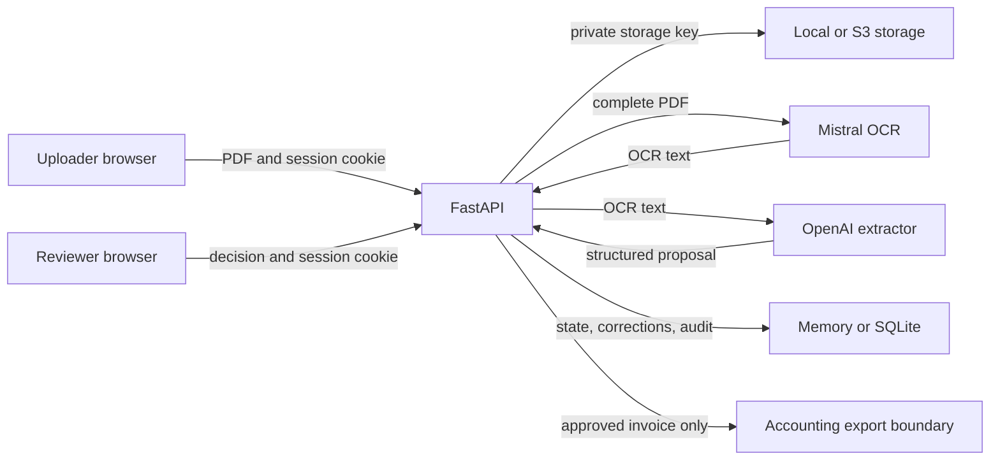

# Security And Privacy Assurance V1

- Assessment date: 15 July 2026
- Assessment mode: Combined baseline and `SELF_VERIFICATION`
- Candidate: `main` at `b519f4150a01483b6112aa94416d69cf3733069a` plus the inspected working tree
- Intended boundary: local portfolio demo with synthetic or explicitly permitted test invoices
- Assessor: Codex, which also contributed to the implementation
- Status: Draft security decision; not an independent audit or compliance certification

Current decision and executed final gates are recorded in the
[Security Hardening Completion Audit](security-completion-audit.md). Candidate references and
observations below preserve the original 15 July baseline unless explicitly marked remediated.

## Post-Audit Remediation

SEC-001 through SEC-010 received application-level remediation and self-verification on 19 July
2026. The production ClamAV boundary for SEC-003 is implemented and test-covered but not yet
verified against an authorized scanner service. The remediation record is split across
[V1](security-remediation-v1.md), [V2](security-remediation-v2.md),
[V3](security-remediation-v3.md), [V4](security-remediation-v4.md),
[V5](security-remediation-v5.md), [V6](security-remediation-v6.md), and
[V7](security-remediation-v7.md). The original observations below are retained as the 15 July
baseline. Hosted untrusted uploads and real client data remain blocked pending deployment,
provider-governance, infrastructure-lifecycle, and independent verification gates.

## Executive Verdict

| Intended use | Verdict | Reason |
| --- | --- | --- |
| Local, loopback-only portfolio demo with synthetic data | `PASS_WITH_LIMITATIONS` | Core route protection, workspace filtering, review gates, upload limits, security headers, and secret exclusion have executed evidence. |
| Controlled single-workspace hosted recruiter demo with mock providers and seeded synthetic data | `PASS_WITH_LIMITATIONS` | Hosted security policy, server-owned roles, protected metrics, and deterministic workflow gates are implemented; deployment configuration still requires independent verification. |
| Hosted recruiter demo accepting untrusted uploads | `BLOCKED` | The ClamAV adapter is implemented and test-covered, but no authorized deployed scanner, update policy, network boundary, or live EICAR evidence is bound. |
| Production or real client invoice processing | `BLOCKED` | Provider governance, managed infrastructure lifecycle, backup deletion, production identity/tenancy, and independent verification remain external gates. |

No critical finding was observed. The two high-severity application findings were remediated for the
controlled single-workspace boundary. That does not establish production IAM, multi-tenant isolation,
or independently verified hosted security.

The strongest counterargument is that the repository already labels authentication, SQLite, and local
storage as portfolio-demo controls. That is correct and prevents an overclaim about the current local
use. It does not remove the findings because the roadmap includes a hosted recruiter demo and real-data
evaluation, both of which cross the present trust boundary.

## Scope And Limitations

In scope:

- FastAPI authentication, sessions, authorization, workspace separation, and exposed routes
- PDF upload, storage, preview, processing, review, correction, approval, export, and audit flows
- React credential handling and role presentation
- Mistral OCR and OpenAI extraction data flows
- repository secret hygiene, Python and npm dependencies, GitHub Actions, and container posture
- safe TestClient checks, existing security-focused tests, static analysis, and dependency advisories

Not run in the original baseline (secret scanning and container scanning were completed later):

- destructive testing, production penetration testing, cloud IAM or bucket inspection
- real customer documents, real-provider calls, or credential validation
- DAST against an internet-facing deployment or denial-of-service testing
- legal/privacy assessment, DPA acceptance, data-subject workflow validation, or independent review
- real antivirus scanning, backup restore, audit-log tamper testing, or hosted TLS verification

## Assets, Identities, And Third Parties

| ID | Asset or identity | Sensitivity | Current boundary |
| --- | --- | --- | --- |
| AST-01 | Invoice PDF and rendered preview | Confidential business data; may include names, addresses, bank and tax data | Local private storage or private S3-compatible object |
| AST-02 | Extracted invoice fields and correction history | Confidential structured data | Memory or SQLite; workspace-filtered application access |
| AST-03 | Approval, export, and audit events | Integrity-critical business evidence | Application repositories; not tamper-evident |
| AST-04 | Admin and provider credentials | Secret | Environment variables or ignored `.env` file |
| ID-01 | Browser session | Privileged local administrator session | Opaque process-local cookie |
| ID-02 | Uploader/reviewer/admin API context | Authorization identity | Derived server-side from purpose-specific access tokens and bound into opaque sessions |
| TP-01 | Mistral OCR | External subprocessor boundary | Receives the complete PDF as a base64 data URL |
| TP-02 | OpenAI extractor | External subprocessor boundary | Receives OCR text and returns structured fields |
| TP-03 | S3-compatible storage | Optional external storage boundary | Private object plus short-lived presigned URL |

## Data Flow And Trust Boundaries

Principal boundaries are the browser-to-API session, workspace authorization, private document
storage, two external AI providers, and the approval-gated outbound integration.

## Threat Model

| Threat | Impact | Existing control | Residual decision |
| --- | --- | --- | --- |
| Shared token is stolen or reused to assert another role/workspace | Cross-role or cross-workspace access | Constant-time token comparison and downstream workspace checks | High blocker: bind identity, role, and workspace server-side |
| Hosted public-demo uses local security semantics | Weak token, non-Secure cookie, CSRF exposure, API discovery | Real providers are forbidden in public-demo mode | High blocker: every non-loopback mode must inherit hosted hardening |
| Malicious, malformed, or active-content PDF is uploaded | Parser/browser exploit, resource abuse, stored malicious content | Size, extension, MIME, `%PDF-` signature, EICAR marker, private storage | Require real scanning or sanitization before untrusted hosted uploads |
| Invoice text contains prompt instructions | Manipulated extraction or fabricated fields | User-role OCR input, JSON schema parsing, bounded grounding, deterministic validation, human approval | Add adversarial prompt-injection fixtures and fail-closed evidence rules |
| Sensitive invoice data is retained by providers | Privacy, confidentiality, and jurisdiction exposure | Explicit provider configuration and private local default | Bind ZDR, region, DPA, and permitted-data policy before real data |
| Provider outage or repeated processing consumes quota | Availability and cost exhaustion | Timeouts, bounded retries, max upload size, rate limiting, public-demo mock-only policy | Add per-tenant budgets and stable paid/quota evidence before hosted real providers |
| Outbound request is replayed after ambiguous failure | Duplicate accounting side effect | Approval gate and terminal exported state | Add durable outbound idempotency key and replay evidence |
| Local database or audit records are edited | Loss of audit integrity | Application-generated events and restricted UI | Do not claim tamper evidence; add append-only or integrity verification if required |
| Sensitive GET responses are cached | Invoice or audit data remains on browser/proxy storage | Authenticated routes and short-lived presigned URLs | Add `no-store` to document, workflow, correction, and audit responses |
| Dependency or CI action is compromised | Build or credential compromise | npm lockfile, non-root runtime container, read-only production compose | Pin Python resolution and Actions SHAs; scan release images |

## Privacy And Provider Governance

The application currently has no project-level retention schedule, user-facing deletion operation,
or verified cleanup of S3 parser cache files. Local uploads and SQLite data therefore remain until an
operator performs documented cleanup. This is acceptable only for the narrow local test boundary.

Provider behavior is a configuration and contractual decision, not a code-only guarantee:

- Mistral states that API inputs and outputs may be retained for 30 rolling days for abuse monitoring
  unless zero-data-retention is activated. See the official
  [Mistral privacy policy](https://legal.mistral.ai/terms/privacy-policy).
- OpenAI states that API data is not used to train its models unless the customer explicitly opts
  in. Default abuse-monitoring logs may contain prompts and responses and are retained for up to
  30 days; Modified Abuse Monitoring and Zero Data Retention require approval. See
  [OpenAI data controls](https://platform.openai.com/docs/models/default-usage-policies-by-endpoint).

Before any real invoice is processed, the owner must decide permitted data classes, ZDR settings,
region/jurisdiction, DPA terms, deletion responsibilities, incident ownership, and whether bank or tax
data must be redacted before egress. This report does not make a legal compliance claim.

## Current Verified Controls

| Control | Evidence state | Observed result |
| --- | --- | --- |
| Secret exclusion | `VERIFIED` | `.env` is ignored and untracked; digest-pinned Gitleaks scanned full Git history with only one exact documented local-demo placeholder allowlisted. |
| Production token policy | `VERIFIED` | Production rejects weak/default tokens and requires at least 24 characters. |
| Session cookie | `VERIFIED` | Opaque, revocable, HttpOnly, SameSite Strict; Secure is enabled in production mode. |
| Production CSRF origin check | `VERIFIED` | Cross-origin cookie mutation is rejected by existing TestClient coverage. |
| Route authentication | `VERIFIED` | Business APIs use authentication dependencies; health, readiness, session creation, redirects, and static assets are intentionally public; internal metrics require a dedicated service token. |
| Role and workspace checks | `VERIFIED_WITH_SCOPE` | Purpose-specific credentials map to server-owned role/workspace principals. Production IAM and multi-tenant isolation are not claimed. |
| Upload bounds and path traversal | `VERIFIED` | File size, extension, MIME, PDF signature, generated storage key, and resolved-root checks are tested. |
| Malware protection | `PARTIALLY_VERIFIED` | EICAR marker is blocked; malformed signature-only content is accepted and no real scanner is integrated. |
| Security headers and rate limiting | `VERIFIED` | CSP, frame policy, MIME sniffing protection, referrer policy, permissions policy, and bounded IP rate limiting are exercised. |
| Approval and export gates | `VERIFIED` | Error-level validation blocks approval; only approved invoices reach export; failed delivery remains retryable. |
| CSV formula injection | `VERIFIED` | Export values are escaped and covered by tests. |
| Provider error sanitization | `VERIFIED` | API responses expose bounded error codes rather than provider bodies or credentials. |
| Frontend secret storage | `VERIFIED` | Admin credential is exchanged once and not persisted in localStorage; only UI role and active document ID are stored there. |
| npm advisory state | `VERIFIED` | `npm audit --json` reported zero known vulnerabilities across the current lockfile. |
| Python advisory state | `VERIFIED` | Hash-locked runtime dependencies reported no known advisories; the vulnerable development formatter was removed in favor of Ruff. |
| Container advisory state | `VERIFIED` | Trivy 0.72.0 reported zero HIGH/CRITICAL OS or Python findings with the documented scan policy. |

## Findings

### SEC-001 - Hosted public-demo does not inherit hosted security policy

- Severity: High
- Confidence: High
- Status: Remediated on 19 July 2026; independent verification pending
- Release disposition: No longer blocks the controlled hosted-demo boundary

`is_production_like()` excludes `public-demo`, while weak-token rejection, Secure cookies, CSRF,
and disabled API docs depend on that predicate. Executed TestClient evidence showed public-demo
accepted token `123`, emitted a non-Secure cookie, accepted a cross-origin cookie mutation, and served
OpenAPI. Make security posture depend on exposure (`local` versus hosted), not on provider profile.

### SEC-002 - Shared credential can assert identity, role, and workspace

- Severity: High
- Confidence: High
- Status: Remediated for the single-workspace hosted-demo boundary on 19 July 2026
- Release disposition: Production IAM and individual accountability remain out of scope

`require_admin_context()` accepts one shared token and trusts `X-Workspace-Id`, `X-User-Id`, and
`X-Role`. Browser login always creates an admin session, while the uploader/reviewer switch is only a
localStorage UI choice. Downstream role and workspace checks work, but the authentication boundary can
mint the context they check. Replace this with server-issued user identity and server-owned role and
workspace membership before claiming multi-user authorization.

### SEC-003 - PDF protection is signature-only, not malware assurance

- Severity: Medium
- Confidence: High
- Status: Application boundary implemented and test-covered on 19 July 2026; live ClamAV deployment verification pending

The scanner rejects one EICAR marker and storage checks `%PDF-`, MIME, extension, and size. A malformed
payload beginning with `%PDF-` was accepted in the executed test. Integrate ClamAV or a managed scanner,
bound parser resource limits, and consider sanitization before accepting untrusted hosted uploads.

### SEC-004 - Sensitive document responses are cacheable

- Severity: Medium
- Confidence: High
- Status: Remediated on 19 July 2026; object-store and browser deployment verification pending

`GET /documents/{id}/content` returned no `Cache-Control: no-store`. Workflow, correction, and audit
GET responses also lack a uniform private no-store policy. Apply explicit cache policy to sensitive
document and audit responses and verify S3 response metadata.

### SEC-005 - Provider egress and endpoint policy are not enforced

- Severity: Medium
- Confidence: High
- Status: Application egress policy remediated on 19 July 2026; provider contract and data-governance decision pending

The complete PDF is sent to Mistral and OCR text is sent to the configured extractor. Provider URLs
are environment-controlled but are not restricted to HTTPS or approved hosts; Bandit reported B310 on
both adapters. Enforce HTTPS and an allowlist in hosted modes, document the exact data sent, and bind
ZDR, region, DPA, and permitted-data decisions before real invoices.

### SEC-006 - Retention and deletion are operationally undefined

- Severity: Medium
- Confidence: High
- Status: Application retention and purge boundary remediated on 19 July 2026; backup and object-version lifecycle verification pending

There is no document deletion workflow or verified retention schedule, and S3-downloaded parser cache
files are not removed by the storage adapter. Define retention by data class, implement deletion across
metadata/object/cache/audit boundaries, and test it before real data.

### SEC-007 - Outbound accounting delivery lacks durable idempotency

- Severity: Medium
- Confidence: High
- Status: Remediated and self-verified on 19 July 2026

Create and plan operations have idempotency keys, but `send_approved_invoice()` does not bind a durable
delivery key to the external system. Terminal exported state blocks a simple second success, but an
ambiguous timeout after external acceptance can still be replayed. Add durable idempotency and an
ambiguous-result reconciliation path.

### SEC-008 - AI prompt-injection assurance is not directly tested

- Severity: Medium
- Confidence: Medium
- Status: Remediated with explicit detection limitations on 19 July 2026

OCR text is correctly placed in a user message and the extractor has no tools, while deterministic
validation and human approval reduce consequence. The system instruction does not explicitly treat
invoice instructions as untrusted, and there is no adversarial fixture proving that injected text
cannot replace ungrounded invoice identifiers or dates. Add a security regression set and require
field evidence before consequential use.

### SEC-009 - Build and dependency resolution need supply-chain hardening

- Severity: Medium
- Confidence: High
- Status: Remediated and self-verified on 19 July 2026

Runtime Python requirements and container base images are not digest-pinned, and GitHub Actions use
major-version tags. `pip-audit` found two advisories on development-only Black 24.10.0; the applicable
cache-file advisory is fixed in 26.3.1. The current fixed CI invocation reduces exploitability, but the
pin should still be upgraded. See the
[Black advisory](https://github.com/psf/black/security/advisories/GHSA-3936-cmfr-pm3m).

### SEC-010 - Internal metrics are unauthenticated at application level

- Severity: Low
- Confidence: High
- Status: Remediated at application level on 19 July 2026; private ingress verification pending

`GET /internal/metrics` returns route and status aggregates without authentication. Deployment docs
correctly require a private security group, but the application does not enforce that boundary. Keep
the route off the public ingress or add service authentication.

## Security Acceptance Criteria Before Provider Replacement

1. All non-loopback modes enforce strong credentials, Secure cookies, CSRF, and disabled developer docs.
2. Role and workspace identity are server-derived; UI role selection cannot change authority.
3. Sensitive document, workflow, correction, and audit responses use explicit no-store policy.
4. Hosted upload has real malware scanning or an explicitly isolated/sanitized equivalent.
5. Provider endpoints are HTTPS and allowlisted; requests never redirect credentials to another host.
6. Provider selection records ZDR, retention, data location, DPA, incident, quota, and deletion evidence.
7. Real-data policy defines allowed invoice fields and any required redaction before provider egress.
8. Retention and deletion cover local/S3 objects, parser cache, metadata, correction data, and backups.
9. Outbound delivery has durable idempotency and ambiguous-result reconciliation.
10. Prompt-injection, quota exhaustion, cross-workspace, and negative-role tests pass.
11. Python dependencies and CI actions are reproducibly pinned and the release image is scanned.
12. Metrics require a dedicated service credential and remain outside public ingress.
13. A verifier who did not build the remediation repeats the high-risk checks before a public claim.

## Gate Decision

- `G07_SECURITY_BASELINE`: Draft baseline produced; human approval pending.
- `G11_SECURITY_ASSURANCE`: `PASS_WITH_LIMITATIONS` for local synthetic use and a controlled,
  single-workspace, mock-provider hosted demo after the 19 July remediation self-verification.
- Hosted untrusted-upload or real-data decision: `BLOCKED`; authorized scanner deployment,
  provider-governance evidence, infrastructure lifecycle verification, production identity/tenancy,
  and independent review must be completed before the corresponding capability is enabled.
- Recommended next slice: verify the already-implemented controls in an authorized hosted candidate;
  do not add another application feature to disguise an external acceptance gap.
